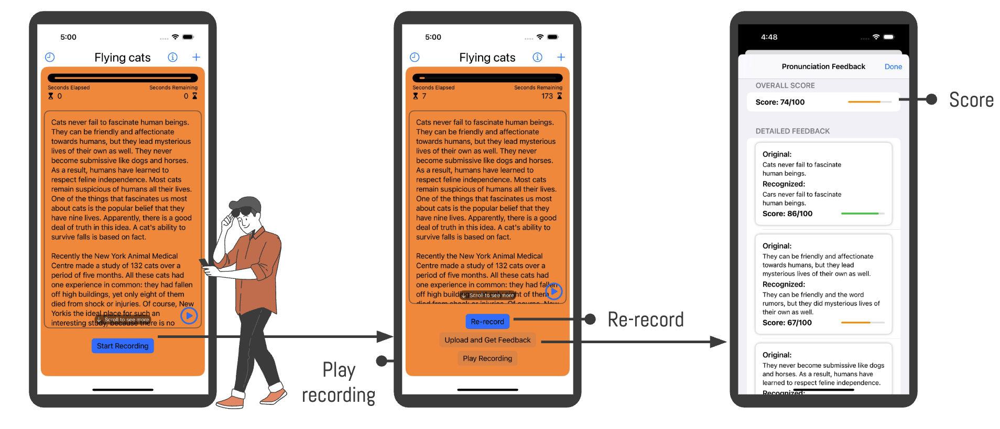
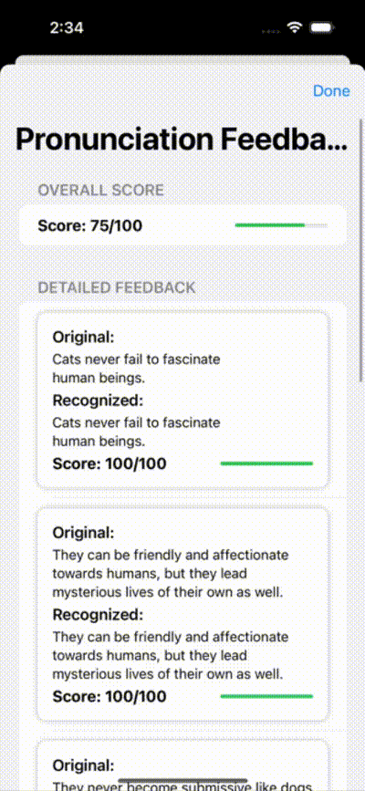

# Language Trainer

## Introduction

Language Trainer is an innovative app designed to help users improve their language skills, particularly in pronunciation and speech recognition. This app is ideal for language learners, educators, and anyone interested in enhancing their linguistic abilities.

## Demo

    

## Video Demo

    

## Features

- **Interactive Speaking Tests**: Engage in speaking tests that provide real-time feedback on pronunciation and fluency.
- **Customizable Practice Sessions**: Tailor your practice sessions with a variety of topics and difficulty levels.
- **Progress Tracking**: Monitor your improvement over time with detailed history logs.
- **Audio Resources**: Access a library of audio resources for immersive learning experiences.
- **User-Friendly Interface**: Enjoy a seamless and intuitive user experience with a beautifully designed interface.

## Contributors

This is iOS app is independently developed by Lyle He.
